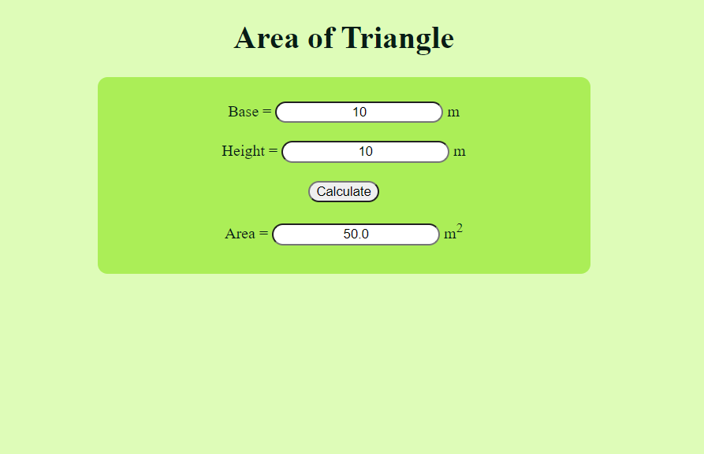

# Design a Website for Server Side Processing

## AIM:
To design a website to perform mathematical calculations in server side.

## DESIGN STEPS:

### Step 1:
Create a django project inside the pulled GitHub Repo.
### Step 2:
Inside the project create a app called mathapp using command "sudo python3 manage.py startapp mathapp".
### Step 3:
Create a template folder inside mathapp and inside than create another folder called mathapp and inside that create a new file "area.html"
### Step 4:
Add the html conents in the area.html.
### Step 5:
Do the mathemical calculation in views.py and link the html tags.
### Step 6:
Do the mathemical calculation in views.py and link the html tags.
### Step 7:
Add mathapp to installed apps in setting.py and add necessary changes.
### Step 8:
Published website: http://saravanakumar.student.saveetha.in:80

## PROGRAM :
### Area.html:
```
<!DOCTYPE html>
<html>
<head>
    <meta charset='utf-8'>
    <meta http-equiv='X-UA-Compatible' content='IE=edge'>
    <title>Area</title>
    <meta name='viewport' content='width=device-width, initial-scale=1'>
    <style>
        body{
            text-align: center;
            background-color: #defcb8;
            color: #081c15;
        }
        div{
            display: block;
            background-color: #abee57;
            text-align: center;
            border-radius: 10px;
            width: 500px;
            height: 200px;
            margin-left: auto;
            margin-right: auto;
        }
        form{
            padding-top: 25px;
        }
        input{
            text-align: center;
            border-radius: 20px;
            text-align: center;
        }
    </style>
</head>
<body>
    <h1>Area of Triangle</h1>
    <div>
        <form method="POST">
            
            Base = <input type="text" name="base" value="{{b}}"> m <br/>
            <br/>
            Height = <input type="text" name="height" value="{{h}}"> m <br/>
            <br/>
            <input type="submit" value="Calculate"><br/>
            <br/>
            Area = <input type="text" name="area" value="{{area}}"> m<sup>2 </sup><br/>
        </form>
    </div>
</body>
</html>
```
### views.py:
```
from django.shortcuts import render

def areacalculation(request):
    context = {}
    context["area"] = "0"
    context["b"] = "0"
    context["h"] = "0"
    if request.method == "POST":
        b = request.POST.get("base","0")
        h = request.POST.get("height","0")
        area = ((int(b) * int(h))/2)
        context["area"] = area
        context["b"] = b
        context["h"] = h
    return render(request,"mathapp/area.html",context)
```
### urls.py:
```
from django.contrib import admin
from django.urls import path
from mathapp import views

urlpatterns = [
    path('admin/', admin.site.urls),
    path("areaofrectangle/",views.areacalculation,name="areaofrectangle"),
    #The below line is to display the html page on our site without /staic/areaofreactangle.
    path("",views.areacalculation,name="areaofrectangleroot")
]
```
## OUTPUT:

## Result:
Thus a website is designed to perform mathematical calculations in server side is hosted.
